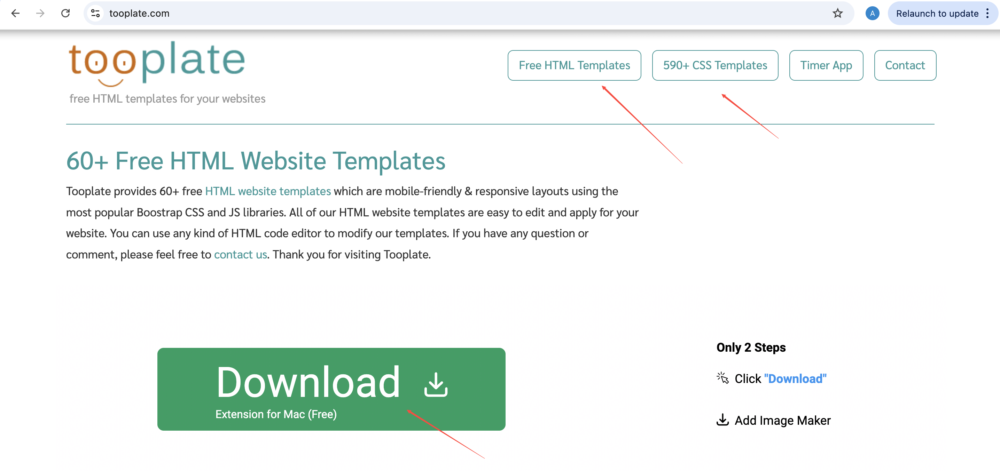
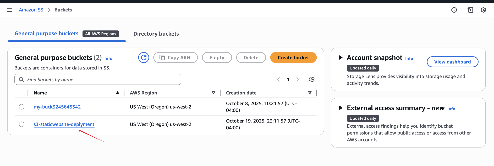
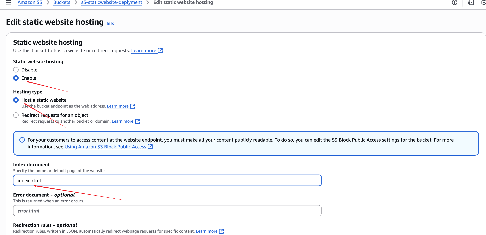
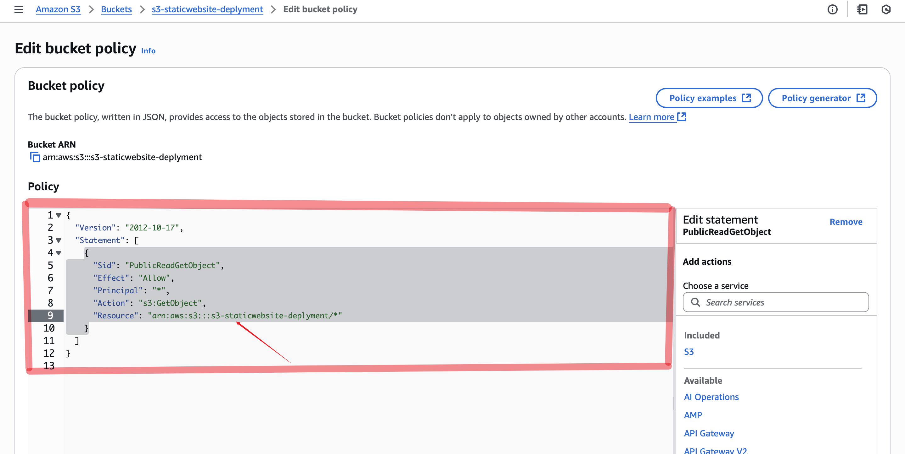

# Static Website Hosting/Deployment to AWS S3

# Introduction
In this project, I will creating and configuring a simple static website. I will be configuring a static website with a custom error page. This will demonstrate how to create a cost-efficient website hosting for sites that consist of files like HTML, CSS, JavaScript, fonts, and images.

# Solution
Log in to your AWS environment and select your prefered region

# Create S3 Bucket

Firstly, In a new browser tab, Open https://www.tooplate.com and download any of the HML template or CSS template you prefered for the code.

In the AWS Management Console, navigate to S3.

# Click Create bucket.

Set the following values:

. Bucket name: my-bucket- with the AWS account ID or another series of numbers at the end to make it globally unique

. In the Block Public Access settings for this bucket section, un-check Block all public access.

Ensure all four permissions restrictions beneath it are also un-checked.
Check the box to acknowledge that turning off all public access might result in the bucket and its objects becoming public.

Leave the rest of the settings as their defaults.

Click Create bucket.

Next step- Uploading the files

. Click the bucket name.

. Click Upload.

. Click Add files, and upload the downloaded files to your S3 Bucket. Again click on add folder and upload folder to your S3 Bucket. which are the Files you folders you previously downloaded and saved from tooplate website-depending on the type of Template you downloaded. 

. Leave the rest of the settings as their defaults after uploading

. Click Close in the upper right.

!uploaded-files/folders](images/S3-UploadedFiles:Folders.png)

# Enable Static Website Hosting

. Click the Properties tab.

. Scroll to the bottom of the screen to find the Static website hosting section.

On the right in the Static website hosting section, click Edit.

On the Edit static website hosting page, set the following values:

. Static website hosting: Select Enable.
. Hosting type: Select Host a static website.
. Index document: Enter index.html.
. Error document: Enter error.html.
. Click Save changes.

. In the Static website hosting section, open the listed endpoint URL in a new browser tab. Once opened, you'll see a 403 Forbidden error message.

# Apply Bucket Policy

. Back in S3, click the Permissions tab.

. In the Bucket policy section, click Edit.

. Above the code entry box, copy the bucket ARN.

. On the right, click Policy generator.

. Select the following values:

. Select Type of Policy: Select S3 Bucket Policy.
. Effect: Select Allow.
. Principal: Enter *.
. Actions: Select GetObject.
. Amazon Resource Name (ARN): Paste the name you added earlier followed by /* so the policy applies to all objects within the bucket.
. Click Add Statement > Generate Policy.

Copy the displayed policy, and go back to the bucket policy screen and paste the JSON. You can ignore any errors.

Click Save changes.

# Exampls

{
	"Version": "2012-10-17",
	"Statement": [
		{
			"Sid": "PublicReadGetObject",
			"Effect": "Allow",
			"Principal": "*",
			"Action": "s3:GetObject",
			"Resource": "arn:aws:s3:::s3-staticwebsite-deplyment/*"
		}
	]
}

. Refresh the browser tab with the static website (the endpoint URL you opened earlier). This time, the site should load correctly.

# Conclusion
Hosting a static website on Amazon S3 proved to be a reliable, cost-effective, and scalable solution. By leveraging S3’s high availability and seamless integration with AWS services, the deployment process was straightforward and efficient.